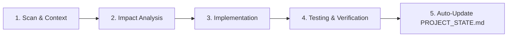

# Study XP Tracker - Agent Rules & Development Guidelines

This document defines the strict rules, architectural standards, and coding conventions that any AI Assistant/Agent MUST follow when working on the **Study XP Tracker** project.

---

## 1. Project Overview & Tech Stack

- **Frontend**: React 19, Vite 8, Tailwind CSS v4, Framer Motion, Lucide React, Recharts, SockJS-client, StompJS.
- **Backend**: Java 21, Spring Boot 3.3.1, Spring Security 6 (JWT + Google OAuth2), Spring Data JPA, Hibernate, Flyway Migration, Redis 7 (Lettuce), WebSocket STOMP.
- **Database & Storage**: PostgreSQL 15, Redis 7, Cloud Storage (Azure Blob Storage / Cloudinary).
- **Infra & DevOps**: Docker, Docker Compose, Terraform, GitHub Actions.

---

## 2. Frontend Rules (React 19 & Tailwind CSS v4)

### 2.1. Multi-Language / Internationalization (i18n) - MANDATORY
- All user-facing text (UI labels, buttons, placeholders, tooltips, toast messages, modal titles, error messages, etc.) **MUST** be defined in all **3 supported languages**: `en` (English), `vi` (Vietnamese), and `zh` (Chinese) in `frontend/src/context/LanguageContext.jsx`.
- Access translations using `const { t } = useLanguage();` and `t('section.key')` or `t('key')`.
- **STRICTLY PROHIBITED**: Hardcoding static text strings directly in JSX without going through `LanguageContext`.

### 2.2. UI/UX Design & Styling
- **Glassmorphism & Theme Aesthetics**: Maintain the app's established Glassmorphism design system (`backdrop-blur-md`, subtle transparent borders `border-white/10` or `border-black/10`, refined drop shadows).
- **Dark/Light Mode**: Full support for both Dark and Light themes. Never use static text colors that break contrast on dark/light backgrounds (always combine classes like `text-slate-800 dark:text-white` or equivalent).
- **Icons**: Exclusively use `lucide-react`. Maintain consistent icon size, styling, and stroke width.
- **Responsive Design**: Ensure flawless display and touch-target usability across Mobile, Tablet, and Desktop. Pay special attention to specific breakpoints (e.g., hiding navbar text labels when screen width is below `lg`, adapting floating widgets on mobile screens).
- **Animations**: Use `framer-motion` for smooth modal transitions, dropdowns, and floating badges.

### 2.3. API Integration & WebSocket Management
- **Centralized API Calls**: All API request functions must be centralized in `frontend/src/api.js`. Do not write standalone `axios.get/post` scattered throughout component files.
- **Token Interceptor**: Leverage the existing Axios instance in `api.js` for automatic Bearer header attachment and JWT refresh flow.
- **WebSocket (STOMP)**: Connect and subscribe to topics/queues via `frontend/src/websocket.js` or STOMP client. **Always unsubscribe** (`subscription.unsubscribe()`) or clean up connections in the `useEffect` cleanup return function when components unmount.

---

## 3. Backend Rules (Spring Boot 3.3 & Java 21)

### 3.1. Layered Architecture
- **Controller**: Handle HTTP requests, validate input with `@Valid`, and delegate business logic to Services. Return standardized `ResponseEntity<ApiResponse<T>>` or DTO responses.
- **Service**: Contain all core business logic, XP calculation, authorization checks, anti-cheat validation, and Redis/Database operations.
- **Repository**: Extend `JpaRepository`. Optimize queries with indexed JPQL or Native Queries when necessary.
- **DTOs**: Strictly separate Request/Response DTOs from JPA Entities. Utilize Jakarta Validation annotations (`@NotNull`, `@NotBlank`, `@Size`, `@Min`, `@Max`, etc.).

### 3.2. Database Management & Flyway Migrations - MANDATORY
- Any database schema change (adding tables, altering columns, adding indexes or foreign keys) **MUST** be implemented via a new sequential Flyway migration file:
  `backend/src/main/resources/db/migration/V<NextVersion>__<description>.sql`
- **STRICTLY PROHIBITED**: Modifying or deleting existing committed migration files (such as `V1__` through `V17__`), as this breaks Flyway schema history checksums in production.

### 3.3. Security & Authorization
- Retrieve current authenticated user details using `@AuthenticationPrincipal UserPrincipal currentUser` or `SecurityContextHolder`.
- **Resource Ownership Check**: Always verify that the target resource (StudyDocument, Event, Session, Task, etc.) belongs to `currentUser.getId()` or that the user holds `ROLE_ADMIN` before performing update or delete actions.
- Never expose sensitive information (password hashes, secret keys) in API responses.

### 3.4. Gamification & Anti-Cheat Logic
- All XP calculations, Level Progression, Streaks, Pomodoro Bonus (+10%), and Presence Auto-pause deductions **MUST be computed and validated server-side**.
- Enforce safety boundaries: maximum single study session duration of 12 hours, valid start/end timestamp ranges.

### 3.5. Redis & Fallback Strategy
- For Redis-backed features (such as Real-Time Leaderboards or Caching): Always wrap Redis operations in `try-catch` with a graceful Fallback querying directly from PostgreSQL if Redis encounters a timeout or connection issue.

---

## 4. Git & Workflow Rules

### 4.1. Git Push Protocol - STRICTLY ENFORCED
- **NEVER execute `git push` unless the user EXPLICITLY requests it in the CURRENT turn/prompt.**
- Even if the user requested a push in a previous turn or session, **DO NOT** automatically push code in subsequent modifications unless explicitly commanded in the current prompt.

### 4.2. Feature Branching Workflow - MANDATORY
- **When developing or pushing a new feature**, always create and switch to a separate, dedicated branch (e.g., `feature/<feature-name>` or `feat/<feature-name>`).
- **NEVER push new features directly to the default `main` or `master` branch.** Always verify current branch (`git status` / `git branch`) before committing or pushing.

### 4.3. Commit Message Standards
- Follow Conventional Commits format:
  - `feat: <description>` or `feat(scope): <description>` (New feature)
  - `fix: <description>` or `fix(scope): <description>` (Bug fix)
  - `style: <description>` (UI, formatting, CSS tweaks with no logic change)
  - `refactor: <description>` (Code restructuring without feature change)
  - `chore: <description>` (Build, config, dependencies, documentation)

### 4.4. Code Integrity
- Preserve existing unrelated comments, docstrings, and functionalities.
- When implementing features spanning both Frontend & Backend, verify API payload compatibility.

---

## 5. Feature Development Lifecycle & Workflow - MANDATORY

Every time a new feature, improvement, or bug fix is requested, the Agent **MUST** follow this structured 5-step workflow:

### Step 1: Scan & Context Acquisition
- Check [.agent/PROJECT_STATE.md](file:///e:/Project/study-tracking/.agent/PROJECT_STATE.md) for the latest database migrations (currently `V17`), active modules, endpoints, and components before writing code.
- Read only relevant existing code, service interfaces, DTOs, or React components to understand patterns without unnecessarily scanning unrelated folders.

### Step 2: Impact Analysis & Scoping (Khoanh vùng ảnh hưởng)
- Explicitly identify all affected layers:
  - **Database**: Is a new Flyway migration script needed (`V18__...sql`)?
  - **Backend**: Which Entities, Repositories, Services, DTOs, and Controllers are impacted?
  - **Frontend**: Which UI pages, components, modals, and API functions in `api.js` need modifications?
  - **i18n**: What translation keys must be added to all 3 languages (`en`, `vi`, `zh`) in `LanguageContext.jsx`?
  - **Security & Authorization**: Which permission checks and resource ownership validations must be enforced?

### Step 3: Implementation
- Implement backend and frontend changes following the layered architecture and Glassmorphism design system.
- Ensure backwards compatibility and preserve existing unrelated features and comments.

### Step 4: Verification & Comprehensive Testing
- **Backend Unit & Integration Tests**:
  - Implement test classes in `backend/src/test/java/com/studytracker/` using JUnit 5, Mockito, and `MockMvc` / `@SpringBootTest`.
  - Cover both **Happy Paths** and **Edge / Error Cases** (unauthorized access, validation failures, boundary limits, anti-cheat violations, missing entities).
  - Ensure all tests pass cleanly before completing the turn.
- **Frontend Verification**:
  - Run linter checks (`npm run lint` / `oxlint`) to ensure zero syntax or linting errors.
  - Verify UI component state handling, responsive breakpoints, fallback error boundaries, and complete i18n coverage.

### Step 5: Synchronize & Update PROJECT_STATE.md - MANDATORY
- **AUTOMATIC UPDATE**: Upon completing and verifying the feature, the Agent **MUST automatically update [.agent/PROJECT_STATE.md](file:///e:/Project/study-tracking/.agent/PROJECT_STATE.md)** to document:
  - Any new Flyway database migration versions added (e.g. `V18`).
  - Any new or modified backend API endpoints, DTOs, or services.
  - Any new frontend components, pages, modals, or widgets.
  - The latest project progress and state so future sessions have full, instant context.
